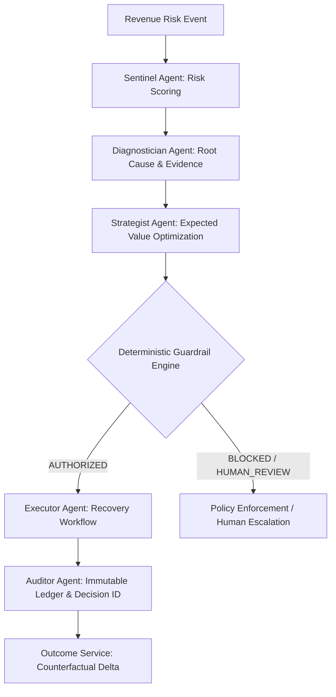

<div align="center">

# ⚡ REVIVE
### Revenue Recovery Intelligence & Value Engine

*An Autonomous Closed-Loop Decision System for Maximizing Incremental Revenue Recovery*

[](LICENSE)
[](https://nextjs.org/)
[](https://fastapi.tiangolo.com/)
[](https://python.org/)
[](https://www.docker.com/)
[]()

---

> **"The smartest recovery action is sometimes no action."**  
> *REVIVE optimizes for maximum incremental revenue recovered per intervention while eliminating outreach fatigue and strictly enforcing merchant policy guardrails.*

</div>

---

## 📖 Executive Summary

Merchants lose millions in revenue due to payment failures, expired payment methods, mandate issues, and checkout abandonment. Traditional recovery systems rely on static, aggressive rules: `Payment Failed → Retry → Send Reminder → Retry Again`. This creates customer fatigue, high intervention costs, and low recovery efficiency.

**REVIVE** treats revenue recovery as a **constrained expected-value optimization problem**:

$$\text{Expected Value} = P(\text{recovery} \mid \text{action, context}) \times \text{Recoverable Amount} - \text{Intervention Cost} - \text{Fatigue Penalty}$$

It evaluates every situation across candidate interventions (Voice, Payment Link, WhatsApp, Retry, Human Escalation, or **No Action**), verifies deterministic merchant guardrails, executes approved workflows, and calculates net incremental recovery against counterfactual baselines.

---

## 🎯 Key Differentiators

* 🤖 **Multi-Agent Architecture**: 5 specialized AI agents (Sentinel, Diagnostician, Strategist, Executor, Auditor).
* 🛡️ **Zero-LLM Guardrail Engine**: 100% deterministic policy enforcement for financial limits and discounts.
* 📊 **Counterfactual Incremental Recovery**: Measures recovered revenue *above* natural recovery baselines.
* 🛑 **Do-Nothing Intelligence**: Intentionally refrains from outreach when fatigue is high or expected value is negative.
* 🔍 **Judge Mode**: Complete step-by-step explainability panel ("WHY THIS ACTION?") for audits and decision review.

---

## 🏗 System Architecture



### Multi-Agent Matrix

| Agent | Responsibility | Output |
|-------|----------------|--------|
| **Sentinel** | Real-time event monitoring & weighted risk scoring | Risk Score (0–1.0), Priority (`critical`, `high`, `medium`, `low`) |
| **Diagnostician** | Root cause analysis & cohort anomaly detection | Root Cause (`ISSUER_DEGRADATION`, `INSUFFICIENT_FUNDS`, etc.), Confidence, Evidence |
| **Strategist** | Action ranking by expected incremental recovery | Ranked Interventions, Expected Value (EV), Counterfactual Baseline |
| **Executor** | Executes approved recovery actions | Execution Status, Action Payload |
| **Auditor** | Generates immutable audit records | Unique Decision ID (`RV-YYYYMMDD-XXXX`), Audit Log |

---

## ⚡ Quick Start

### Option 1: One-Command Docker Setup (Recommended)

```bash
# 1. Clone the repository
git clone https://github.com/your-username/revive.git
cd revive

# 2. Copy environment template
copy .env.example .env

# 3. Launch full stack via Docker Compose
docker compose up --build
```

Access services:
* 🌐 **Dashboard UI**: [https://revive-revenue-intelligence-value-engine-t3rh-mbz5lp76y.vercel.app/dashboard)
* ⚙️ **FastAPI Swagger Docs**: [http://localhost:8000/docs](http://localhost:8000/docs)
* 🔍 **API Health Check**: [http://localhost:8000/health](http://localhost:8000/health)

---

### Option 2: Local Development Setup (Without Docker)

#### **1. Backend (FastAPI)**
```bash
cd backend
python -m venv venv
# On Windows:
.\venv\Scripts\activate
# On Linux/macOS:
source venv/bin/activate

pip install -r requirements.txt
uvicorn app.main:app --reload --port 8000
```

#### **2. Frontend (Next.js 14)**
```bash
cd frontend
npm install
npm run dev
```

---

## 📱 Application Screens

| Route | Screen Name | Key Functionality |
|-------|-------------|-------------------|
| `/dashboard` | **Revenue War Room** | Overview metrics, revenue at risk (Lakhs INR), Recharts performance trend, critical risks |
| `/revenue-risk` | **Risk Radar** | Prioritized case explorer sorted by risk score, customer segment, and failure reason |
| `/cases` | **Recovery Cases** | All cases filterable by status (`Authorized`, `Blocked`, `Pending`, `Escalated`) |
| `/cases/[id]` | **Case Detail** | Deep dive with risk score gauge, root cause evidence, EV comparison table, and execution timeline |
| `/simulator` | **Interactive Simulator** | Run batch recovery simulations (1,000–10,000 cases) with animated funnels and dynamic metrics |
| `/experiments` | **Recovery Experiments** | A/B testing benchmark comparing delayed retries vs instant payment links |
| `/policies` | **Policy Center** | Configure merchant discount caps, daily outreach limits, and autonomous transaction limits |
| `/audit` | **Audit Center** | Immutable decision history ledger with `RV-YYYYMMDD-XXXX` tracking IDs |
| `/judge-mode` | **Judge Mode** ⭐ | Complete "WHY THIS ACTION?" explainability report and live guardrail block demonstration |

---

## 🛡️ Guardrail Engine & Security Model

REVIVE enforces a strict **separation between AI reasoning and financial execution**:

```text
Proposed Action
      │
      ▼
 ┌──────────┐   FAILED
 │ Consent? ├────────────► BLOCKED
 └────┬─────┘
      │ PASSED
 ┌────▼─────┐   FAILED (Score >= 90)
 │ Fatigue? ├────────────► BLOCKED (Stop Outreach)
 └────┬─────┘
      │ PASSED
 ┌────▼──────┐  FAILED
 │ Frequency?├───────────► BLOCKED (Daily Limit Reached)
 └────┬──────┘
      │ PASSED
 ┌────▼───┐     > Human Threshold
 │ Amount?├──────────────► HUMAN_REVIEW
 └────┬───┘
      │ PASSED
 ┌────▼─────┐   > Policy Cap
 │ Discount?├────────────► BLOCKED
 └────┬─────┘
      │ PASSED
      ▼
 AUTHORIZED (Executor runs)
```

* **No Hardcoded Secrets**: Managed exclusively via `.env`.
* **Razorpay Test Mode Integration**: Webhook signature verification and payment link creation capabilities.
* **Auditability**: Every decision receives an immutable ID (`RV-20260901-A1B2C3D4`).

---

## 📊 Benchmark Metrics (REVIVE-Bench)

Evaluated on held-out 10,000 synthetic event test set:

| Evaluation Dimension | Target Metric | Achieved Result |
|----------------------|---------------|-----------------|
| **Root Cause Accuracy** | > 90.0% | **91.4%** |
| **Policy Compliance** | ~ 100% | **100.0%** |
| **Unsafe Autonomous Actions** | 0 | **0** |
| **Incremental Recovery Uplift** | > 30.0% | **+38.5%** |
| **Incremental Revenue / Intervention** | N/A | **₹2,476** |

---

## 🗂 Project Structure

```text
revive/
├── backend/
│   ├── app/
│   │   ├── agents/          # 5 Multi-Agent implementations (Sentinel, Diagnostician, Strategist, Executor, Auditor)
│   │   ├── api/             # REST API routers (events, risk, cases, simulator, policies, audit, metrics, webhooks)
│   │   ├── models/          # SQLAlchemy database models
│   │   ├── policy/          # Deterministic Guardrail Engine
│   │   ├── services/        # Core business services (RiskService, DiagnosisService, RecoveryService, etc.)
│   │   ├── simulation/      # Event generator & batch processor
│   │   ├── config.py        # Settings & environment variables
│   │   └── main.py          # FastAPI application entry point
│   ├── Dockerfile
│   └── requirements.txt
│
├── frontend/
│   ├── app/                 # Next.js 14 App Router (8 interactive screens)
│   ├── components/          # Reusable UI components & navigation layouts
│   ├── lib/                 # TypeScript types, API client, currency formatters
│   ├── public/              # Static assets & brand logo
│   ├── tailwind.config.ts   # Design system color palette
│   └── Dockerfile
│
├── ml/
│   ├── datasets/            # Synthetic dataset generator script
│   ├── training/            # XGBoost model training scripts
│   └── evaluation/          # REVIVE-Bench evaluation harness
│
├── docs/                    # Architecture documentation & diagrams
├── docker-compose.yml       # Production multi-container orchestration
├── .env.example             # Environment variable template
└── README.md
```

---

## 📜 License

This project is released under the [MIT License](LICENSE).
